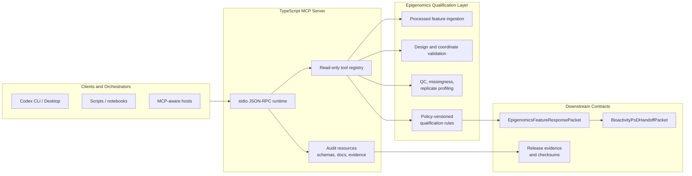

# Epigenomics MCP

[](https://github.com/ToxMCP/epigenomics-mcp/actions/workflows/ci.yml)
[](./LICENSE)
[](./docs/validation-statement.md)
[](https://nodejs.org/)
[](https://www.python.org/)
[](https://modelcontextprotocol.io/)

> Part of **ToxMCP** Suite -> https://github.com/ToxMCP/toxmcp

**Public MCP server for processed epigenomic feature evidence qualification, coordinate/design validation, provenance-preserving packetization, and Bioactivity-PoD-ready handoff packaging.**
It turns already-processed methylation, chromatin accessibility, histone mark, region-level, and summary epigenomic evidence into auditable qualification results and warning-bearing downstream packets without taking over raw FASTQ/IDAT preprocessing, peak calling, causal enhancer inference, PoD/BMD modelling, or regulatory conclusion generation.

> Processed evidence in; qualified, warning-bearing, PoD-ready epigenomics packet out.

---

## Architecture



The released surface is intentionally bounded:

- this MCP owns processed-feature qualification, not raw assay preprocessing
- coordinates, genome build, design adequacy, missingness, and provenance are validated fail-closed
- warnings preserve scientific caveats instead of converting proximity or context into causal claims
- release readiness is backed by schema drift checks, golden benchmark comparisons, nondeterminism checks, and checksummed release evidence

## What this MCP does

- Reads processed epigenomic feature tables and experimental designs
- Validates genome build, coordinate system, chromosome bounds, and feature coordinate semantics
- Profiles deterministic QC, missingness, variance, and replicate adequacy
- Assesses cell-composition and cytotoxicity context without silently overclaiming causality
- Applies policy-versioned qualification rules with explainable rule traces
- Builds `EpigenomicsFeatureResponsePacket` and `BioactivityPoDHandoffPacket` outputs
- Exposes strict MCP tool input/output schemas, structured content, annotations, and read-only audit resources
- Generates release evidence with SHA-256 checksums for schemas, golden outputs, benchmark manifests, validation docs, and npm pack metadata

## Release status

The current `0.1.0` release surface is audit-ready for the bounded processed-evidence qualification scope:

- `npm run typecheck` passes
- `npm test` passes
- `npm run smoke:mcp` passes
- `npm run benchmark:gate` reports `READY`
- `npm run release:evidence` writes checksummed audit evidence under `release-evidence/`
- `npm run verify:evidence` verifies evidence freshness, checksums, package coverage, and MCP resource coverage
- `.venv/bin/pytest tests/python -q` passes
- `npm run verify:release` passes

The release gate remains a product-level audit-readiness status for this MCP boundary, not a claim of biological truth, regulatory acceptance, or downstream PoD/BMD validity.

## Quickstart TL;DR

```bash
npm install
npm run build
npm run smoke:mcp
npm run benchmark:gate
npm run release:evidence
npm run verify:evidence
npx epimcp serve
```

Python package smoke checks are available for the small companion package:

```bash
python -m venv .venv
source .venv/bin/activate
python -m pip install -e .[dev]
.venv/bin/pytest tests/python -q
```

## MCP public tools

When running as an MCP server over stdio, the public tool surface includes:

| Tool | Description |
|------|-------------|
| `health` | Return server health status |
| `ingest_dataset` | Validate feature, design, and provenance evidence chain |
| `validate_design` | Validate experimental design for dose-response readiness |
| `qualify_features` | Qualify epigenomic features for downstream Bioactivity-PoD use |
| `generate_handoff` | Generate a Bioactivity-PoD handoff summary |
| `validate_coordinates` | Validate coordinate system declarations |
| `profile_qc` | Compute deterministic QC profile |
| `profile_missingness` | Compute missingness profile |
| `ingest_cell_composition` | Ingest cell-composition evidence |
| `ingest_cytotoxicity` | Ingest cytotoxicity context |
| `summarize_by_group` | Summarize feature responses by dose group |
| `read_table` | Read a delimited table with file guardrails and pagination |
| `read_design` | Read a design table into the design contract |
| `generate_qc_report` | Generate a regulator-readable QC report |
| `convert_coordinates` | Normalize coordinate records to 0-based half-open coordinates |

All tools are registered with `registerTool(...)`, strict input schemas, output schemas, read-only/idempotent annotations, and `structuredContent` plus JSON text content for compatibility.

## MCP audit resources

Read-only MCP resources expose contracts and evidence directly to clients:

| Resource URI | Contents |
|--------------|----------|
| `epimcp://schemas/epigenomics-feature-response-packet` | Current response-packet JSON Schema |
| `epimcp://schemas/bioactivity-pod-handoff-packet` | Current Bioactivity-PoD handoff JSON Schema |
| `epimcp://schemas/region-to-gene-mapping` | Region-to-gene mapping JSON Schema |
| `epimcp://schemas/external-database-mapping` | External annotation mapping JSON Schema |
| `epimcp://schemas/base-envelope` | Shared envelope JSON Schema |
| `epimcp://schemas/qualification-policy` | Qualification policy JSON Schema |
| `epimcp://docs/validation-statement` | Regulator-facing validation statement |
| `epimcp://docs/tool-reference` | Tool and usage reference |
| `epimcp://benchmarks/manifest` | Release benchmark manifest |
| `epimcp://release-evidence/manifest` | Latest generated release evidence manifest |
| `epimcp://release-evidence/checksums` | Latest generated checksum list |
| `epimcp://release-evidence/release-gate-json` | Latest captured release-gate JSON |
| `epimcp://release-evidence/release-gate-report` | Latest captured release-gate report |

## Release evidence

Generate the release evidence bundle:

```bash
npm run release:evidence
```

This writes:

- `release-evidence/release-evidence.json`
- `release-evidence/checksums.sha256`
- `release-evidence/release-gate.json`
- `release-evidence/release-gate.txt`
- `release-evidence/npm-pack-dry-run.json`

The evidence manifest records package/config versions, environment details, Git availability, release-gate status, npm pack dry-run metadata, and checksums for the committed audit inputs.
Release evidence is generated from a clean source tree. For release commits, commit code/docs/config changes first, run `npm run release:evidence`, then commit the refreshed `release-evidence/` bundle.

The npm package includes the files backing all registered audit resources, including current schemas, validation docs, benchmark manifest, golden benchmark outputs, and the latest release evidence bundle.

## Public verification

Public audit verification should check both local commands and GitHub evidence:

- run `npm run verify:evidence` to prove the committed bundle is schema-valid, checksum-valid, package-visible, and tied to the current source lineage
- run `npm run verify:release` for the full local release gate
- confirm GitHub CI, Docker Build and Smoke, Benchmarks, Schema Drift Guard, and Handoff Validation are green
- download the `ci-release-evidence` Actions artifact from the successful Node 20 CI run when independent CI-generated evidence is needed

## ToxMCP suite fit

| Module | Role in the suite | Relationship to this repo |
|--------|-------------------|---------------------------|
| `Epigenomics MCP` | Processed epigenomic evidence qualification and handoff | This repo |
| `Bioactivity-PoD MCP` | Point-of-departure and dose-response modelling | Downstream handoff consumer |
| `Evidence Ingestion Study Registry MCP` | Evidence intake, provenance, and study packaging | Upstream or adjacent evidence source |
| `Annotation/Ontology MCP` | Identifier, ontology, and mapping context | Integration surface for annotation enrichment |
| `ToxMCP Hub` | Suite control plane and contract index | Suite-level orchestration context |

## Project boundary

This MCP is intentionally conservative about what it does not claim.

It is **not**:

- a raw FASTQ, BAM, or IDAT processing system
- a bisulfite alignment or methylation-calling engine
- a peak caller
- a chromatin-state learner
- an enhancer-gene causal inference engine
- a miRNA target-prediction engine
- a PoD/BMD modeller
- a regulatory conclusion generator

It **does**:

- preserve measured identifiers and coordinates separately from mapped targets
- fail closed on missing or malformed coordinate/build semantics
- surface confounding and interpretation warnings
- preserve provenance with required upstream processing steps
- provide machine-verifiable schemas, benchmarks, and release evidence

See [docs/validation-statement.md](./docs/validation-statement.md), [docs/tool-reference.md](./docs/tool-reference.md), and [toxmcp.manifest.yaml](./toxmcp.manifest.yaml) for the detailed contract and audit surface.

## Repository layout

- `src/epimcp/`: TypeScript MCP server, CLI, tool registry, resources, and config
- `src/contracts/`: Zod contracts for packets, provenance, design, features, QC, mapping, and policy
- `src/ingestion/`: Processed table readers and feature-table canonicalization
- `src/qualification/`: Policy, rule engine, explainability, and claim guards
- `src/qc/`: QC, missingness, variance, and confounding profilers
- `schemas/current/`: Committed JSON Schema exports
- `benchmarks/fixtures/synthetic/`: Synthetic release benchmark inputs
- `benchmarks/expected/`: Golden benchmark outputs
- `benchmark-results/`: Latest benchmark and release-gate reports
- `release-evidence/`: Latest checksummed audit evidence bundle
- `docs/`: Boundary, validation, format, coordinate, confounding, and tool references
- `tests/`: Vitest, contract, smoke, equivalence, and Python tests

## Development

```bash
npm run typecheck
npm test
npm run build
npm run smoke:mcp
npm run benchmark:gate
npm run release:evidence
npm run verify:evidence
.venv/bin/pytest tests/python -q
npm run verify:release
```

## Configuration

| Setting | Default | Description |
|---------|---------|-------------|
| `schemaVersion` | `0.1.0` | Schema version for response packets |
| `policyVersion` | `0.1.0` | Default qualification policy version |
| `EPIMCP_ALLOWED_FILE_ROOTS` | current working directory | Comma-separated MCP file-read allowlist roots |
| `EPIMCP_MAX_FILE_BYTES` | `26214400` | Maximum file size for MCP file reads |
| `EPIMCP_DEFAULT_ROW_LIMIT` | `1000` | Default `read_table` row page size |
| `EPIMCP_MAX_ROW_LIMIT` | `5000` | Maximum `read_table` row page size |

## Version and compatibility

- Package version: `0.1.0`
- Schema version: `0.1.0`
- Policy version: `0.1.0`
- Node.js: `>=20`
- Python: `>=3.11`
- Downstream contract: Bioactivity-PoD handoff packet `0.1.0`

## License

MIT
